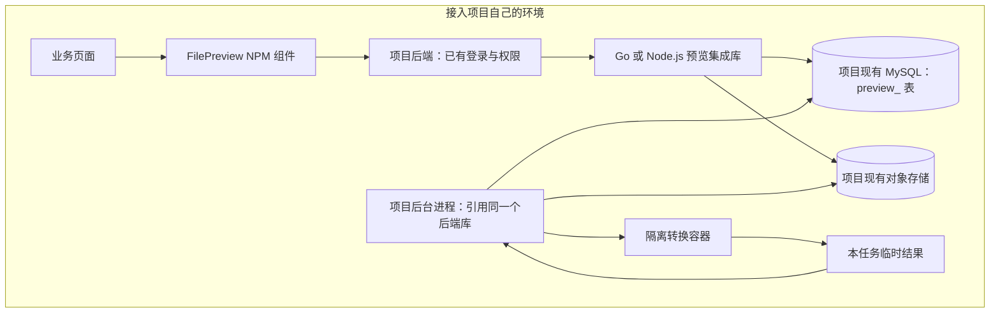
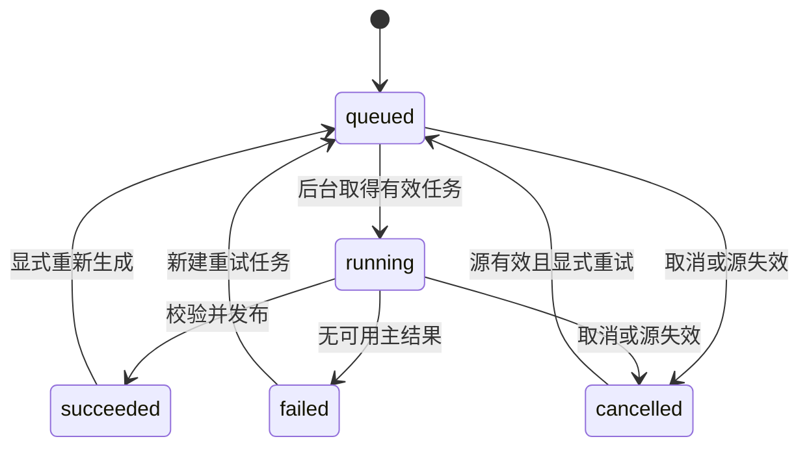

# 公共文件预览库：整体设计

更新时间：2026-09-08 16:24 +0800

版本：v2.0 · 公共库设计规范。包名、接口和目录是拟定契约，尚未发布或实现。

## 1. 项目引入之后得到什么

项目安装预览组件，把自己的文件编号传给组件，再在后端接入统一的预览处理逻辑，就能在原有页面中查看 PDF、Office、表格、图片、网页和文本等文件。排队、转换、部分内容展示、失败重试和大文件按需读取由公共库统一处理。

每个项目保留自己的用户体系、数据库、文件存储与部署。公共库不要求注册另一套平台账号，也不要求把原文件重新上传到公共平台。统一维护的是代码、文件处理规范和组件行为；每个项目使用自己安装的版本。

完整能力由三个部分组成：前端查看组件、后端集成库、文件转换运行环境。前端和 Node.js 后端使用 NPM 包，Go 后端使用 Go module；Office 等格式的转换依赖由统一镜像提供。安装前端包后可以引入组件，但完整的 28 种格式仍需要接好后端处理环境。

## 2. 交付物及安装位置

| 交付物 | 安装位置 | 负责的内容 |
|---|---|---|
| `@unipat/file-preview-react` | 项目前端 | FilePreview 组件、工具栏、状态提示、各格式查看器 |
| `@unipat/file-preview-core` | 项目前端或其他界面封装 | 协议类型、请求客户端、分块加载、状态处理；不依赖 React |
| `@unipat/file-preview-node` | Node.js 后端与项目自己的后台工作进程 | 注册预览、权限接入、任务、数据库与存储适配、HTTP 路由 |
| `host-go` Go module | Go 后端与项目自己的后台工作进程 | 与 Node.js 包相同的后端契约，提供 net/http 入口，可挂到 Gin |
| `preview-converter` 镜像 | 项目的后台处理环境 | Python、LibreOffice、图片与 DICOM 解码、表格格式化及字体 |
| 协议、SQL 和样本 | 随后端包及源码发布 | 保证两种后端的状态、数据和输出行为一致 |

以上 NPM 名称为设计名称，发布注册表和 Go module 地址由库的发布配置统一确定。文档中的安装与调用示例描述实现后的使用方式，不表示当前已存在同名可安装包。

## 3. 完整支持范围

扩展名大小写不敏感。清单来自 2026-09-08 核对的 GDPVal-V2 `server/internal/storage/local.go` 中 allowedExtensions 与 `server/internal/preview/generator.py` 的处理分派。全部 28 种都属于本规范的支持范围。

| 类型 | 扩展名 | 展示内容 |
|---|---|---|
| PDF | `pdf` | 原有页面、缩放、页码、已有文字搜索 |
| 文档 | `doc`、`docx`、`rtf` | 转成 PDF 后阅读 |
| 幻灯片 | `ppt`、`pptx` | 静态页面 |
| 电子表格 | `xls`、`xlsx`、`xlsm` | 工作表、单元格、基础样式与文件保存的计算结果 |
| CSV | `csv` | 保留文本含义的行列数据 |
| 图片 | `png`、`jpg`、`jpeg`、`bmp`、`webp`、`tif`、`tiff` | 图册、缩放、旋转、多帧切换 |
| DICOM | `dcm`、`dicom` | 静态像素帧；无像素文件展示受控基本信息 |
| 网页 | `html`、`htm`、`xhtml` | 清理后的静态页面 |
| 结构化文本 | `json`、`xml`、`xbrl` | 格式化或安全源文本 |
| Notebook | `ipynb` | 已保存单元格、代码和文本输出 |
| 普通文本 | `txt`、`md` | 原文本，Markdown 默认展示源文本 |

具体规则、展示预算及部分内容提示见 [03](03-格式处理与查看器设计.md)。格式支持与单个文件能否完整展开分别描述：损坏、加密、超出资源预算都有明确行为，不能仅返回“支持该后缀”而忽略实际结果。

## 4. 项目与库分别负责什么

| 事情 | 项目负责 | 公共库负责 |
|---|---|---|
| 用户是谁、属于哪个租户 | 使用已有登录中间件提供可信身份 | 每次操作要求有效身份与范围 |
| 某人能否查看或下载附件 | 提供权限判断函数，检查业务对象状态 | 所有读取、生成、重试和下载都调用相应判断 |
| 原文件上传与版本管理 | 沿用已有上传接口，提供不可变版本 | 接收文件引用、核验读取到的字节 |
| 文件在哪里 | 把业务文件引用解析为内部存储句柄 | 通过适配器读取，不猜业务表结构 |
| 数据库与对象存储 | 提供现有连接、桶和权限范围 | 管理 preview_ 表和专属派生结果目录 |
| 转换和展示 | 配置运行环境并挂载组件 | 实现各格式处理和页面交互 |
| 业务文件删除或失效 | 在业务事务中记录事件并通知库 | 立即阻断后续访问、终止任务、清理自己的结果 |
| 项目上线 | 决定何时升级依赖、执行表结构升级 | 提供锁定版本、兼容检查、升级脚本 |

公共库不直接读写用户表、专家任务表或 AI 质检表。预览结果也不改变这些业务状态。允许查看整个文件后，隐藏工作表、文件内批注等展示属性不再被当作额外的业务权限边界。

## 5. 一个项目内的架构

前端组件直接渲染到业务页面中，没有强制要求另开预览站点或使用外层 iframe。HTML 文件内容仍放进组件内部的受限 iframe，避免文件中的内容进入业务页面环境。

数据库只保存引用、状态、清单索引和任务；文件内容在项目存储中。API 与后台进程可以分别部署，但必须使用同一 namespace、数据表、存储前缀和规则版本。后台进程是项目部署的一部分，不开放一个供所有项目共用的公共管理接口。

## 6. 从点击文件到看到内容

1. 项目已经有原文件及不可变版本，例如附件编号 attachment-123、版本 v2。
2. 页面把 `{resourceKey, version}` 传给 FilePreview，组件使用项目提供的 HTTP 客户端请求本项目的预览接口。
3. 项目后端确认登录用户，调用权限函数，解析该版本原文件；库只接受服务器验证后的元数据。
4. 若相同文件版本和处理规则已有结果，直接返回；否则创建一条预览和持久化任务。
5. 后台进程领取任务，从项目存储读取源文件并验证版本及摘要，在隔离容器中生成内容。
6. 校验结果并保存到项目的派生结果目录，事务提交发布指针。
7. 组件读取结果清单，按需显示页面、数据块或图像帧。部分内容缺失时明确显示范围。
8. 页面关闭、切文件或登录身份变化，组件取消未完成请求，释放旧缓存。

再次打开不重新转换。组件因重试网络请求重复调用创建接口时，后端依靠文件版本与处理规则唯一键找到同一条记录。真正的重新生成使用明确的 retry 操作，并单独检查权限。

## 7. 原文件、结果与任务的关系

| 对象 | 含义 |
|---|---|
| 业务文件引用 `resourceKey + version` | 项目已有附件及不可变版本，库不规定业务编号格式 |
| 库内源记录 `source_id` | 验证后的源元数据和内部读取句柄，不复制项目业务表 |
| 预览 `preview_id` | 一个源记录在固定 profile 下的预览入口 |
| 执行任务 `job_id` | 一次实际转换，拥有独立输出目录和有效执行凭证 |
| 发布结果 `published_revision` | 一次完整检查后的不可变结果，供组件固定版本读取 |

所有记录归属 `namespace + tenant_id`。namespace 是服务端配置的项目标识，tenant_id 来自项目登录上下文；浏览器提交的租户字段不作为可信来源。单租户项目使用固定 tenant_id，但不能默认接受缺失身份。

源记录唯一键为 `namespace + tenant_id + resource_key + source_version`，预览唯一键为 `source_id + profile_id`。同一个源版本不能悄悄换字节内容；处理器、字体和展示预算变化形成新的 profile。

## 8. 状态与页面行为

`execution_state` 描述最新一轮生成：queued、running、succeeded、failed、cancelled。

`availability` 描述已发布结果：none、ready、partial。它来自已验证清单；格式处理失败、内容截断、附加输出缺失都不能仅靠前端自行推测。

回到 queued 表示新增 job，不复用旧任务。已有可用结果时重新生成，继续显示上次结果并标注；新任务失败也不把上次已发布结果清空。源文件被删除或权限失效时，停止内容读取，不因还有缓存就继续放行新请求。

## 9. Go 和 Node.js 的共同约定

两个后端库实现同一套公共协议、SQL 表结构和状态规则，使用同一转换镜像。接入项目按自己的后端语言选一个；单个项目的数据写入和任务领取统一由选定的适配器版本管理。

共享 JSON Schema、SQL 升级文件、错误码和行为样本是规范来源。两种实现都必须通过相同的重复创建、并发发布、撤权、源变更和任务恢复用例。语言差异仅体现在如何接收数据库连接、挂接路由和调用项目回调，不改变文件格式和状态含义。

浏览器包可脱离 React 使用 core 的客户端与结果协议封装其他界面，但本设计直接交付的界面组件为 React 19，匹配当前 GDPVal。Go module 接入遵循 [Go 官方依赖管理方式](https://go.dev/doc/modules/managing-dependencies)。

## 10. 部署时项目需要提供的配置

项目提供 namespace、已有数据库连接、表名前缀、原文件读取适配器、派生结果存储适配器、权限函数、转换运行器和静态资源地址。配置中的密钥均留在后端；浏览器只拿项目自身允许公开的路径与文件标识。

NPM 包不在安装时连接数据库、下载原文件、修改项目路由或偷偷启动后台进程。项目显式挂接接口、执行 schema 升级，再启动后台任务管理。转换器镜像自带解析器、LibreOffice 和字体，前端包不携带这些系统依赖。
